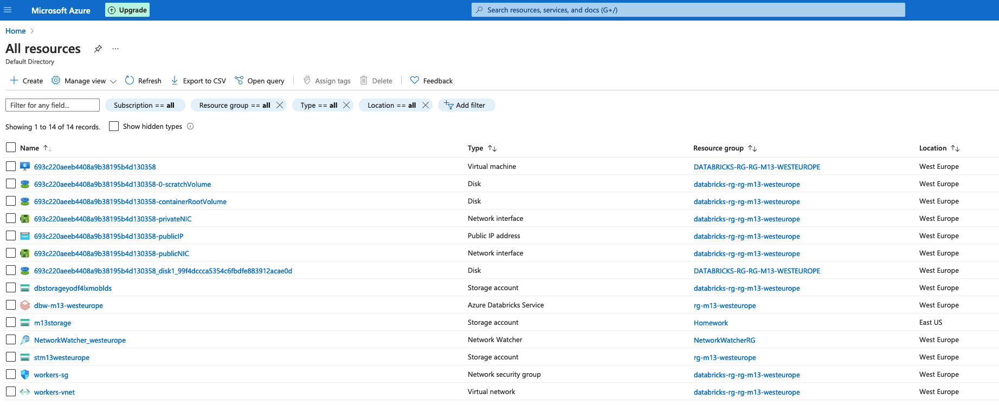
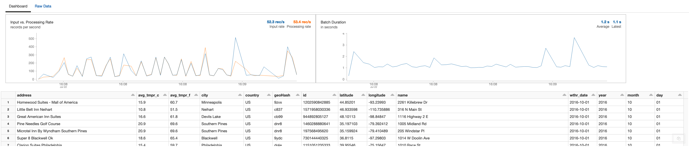
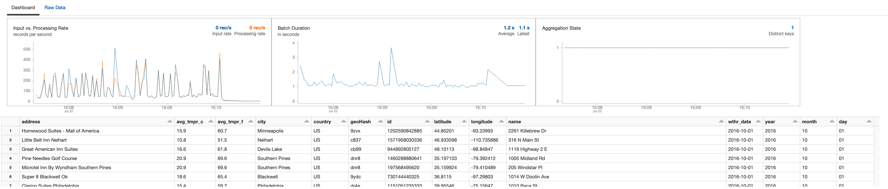
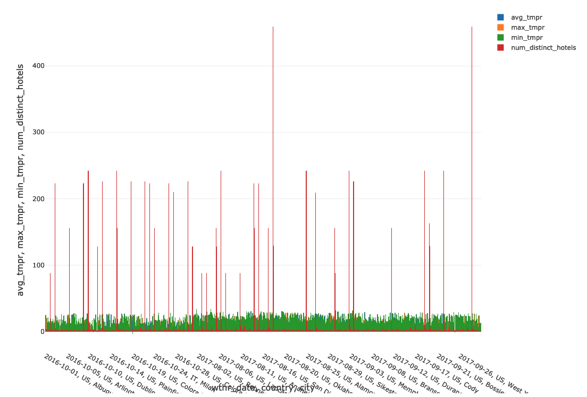
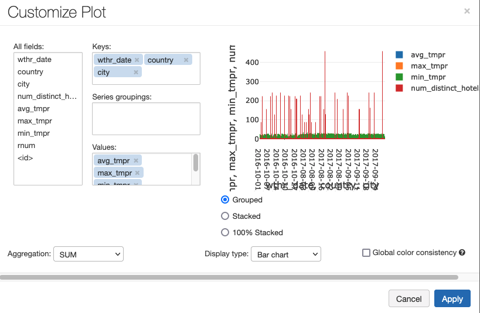

* Code File descriptions

**notebooks/My notebook.py** :  Main notebook to process data.
  
**notebooks/configuration.py** : Notebook to configure the environment


* Modify main.tf
```
  terraform {
  backend "azurerm" {
    subscription_id = <your_subscription_id>
    resource_group_name = <your_resource_group_name>
    storage_account_name = <your_storage_account_name>
    container_name = <your_container_name>
    key = <your_key>
  }
}
```
* Deploy infrastructure with terraform

```
terraform init
terraform plan -out terraform.plan
terraform apply terraform.plan
```

* Launch notebooks on Databricks cluster



* Create stream to get data from Blog Storage



* All data downloaded



* Final results



* Plot settings

